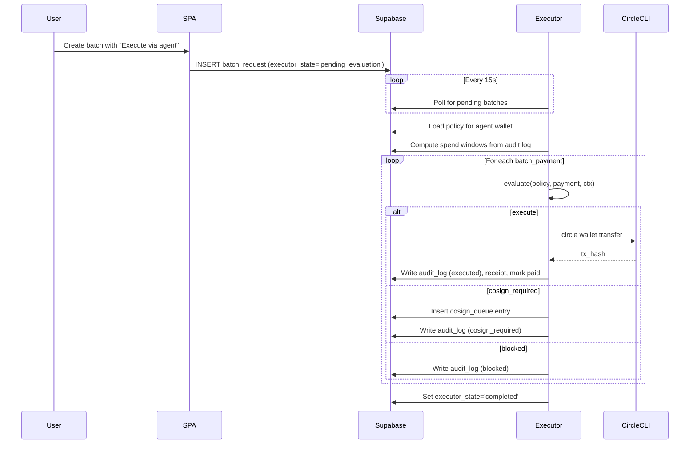
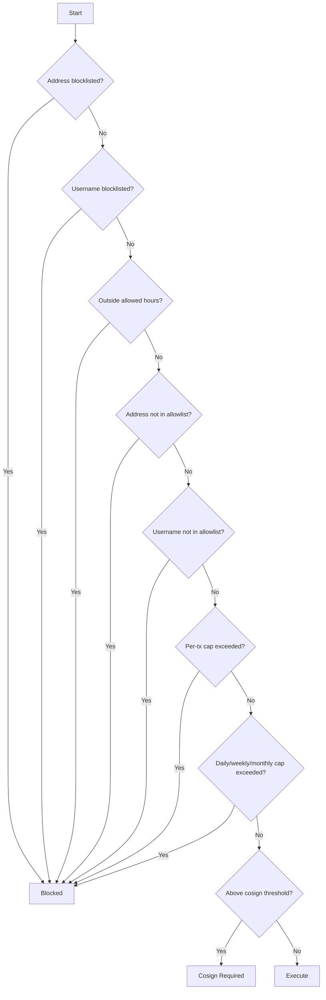
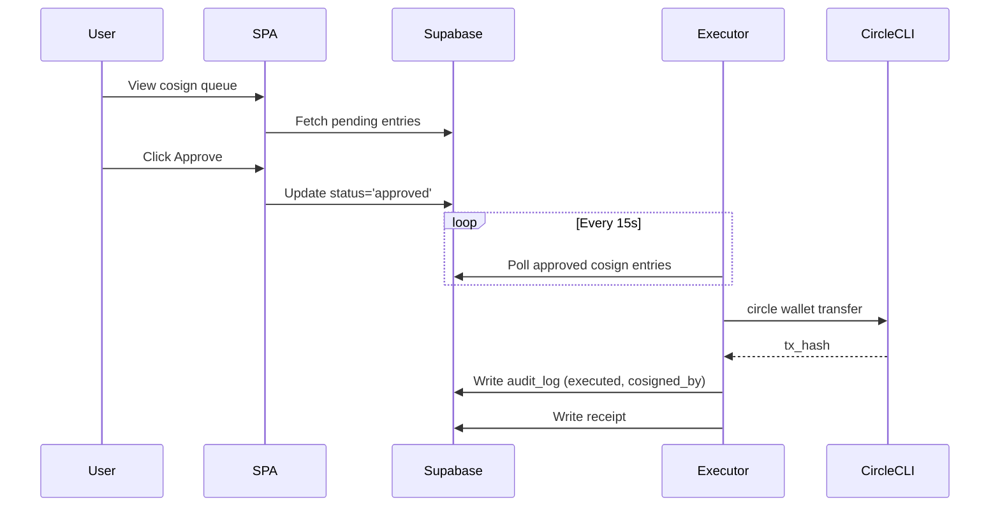

# Agent Stack Architecture

## Overview

The Agent Stack adds two capabilities to Qevor:

1. **AI Treasurer** — Circle Agent Wallets with policy-based spending controls
2. **Autonomous Batch Execution** — policy-gated payroll engine with human escalation

## Batch Executor Flow



## Policy Evaluation Order



## Cosign Approval Flow



## VPS Topology

```
Internet -> Nginx (TLS :443) -> /        -> Static SPA (dist/)
                              -> /api/*   -> qevor-api (Express, :3000)

qevor-executor (systemd, no public port)
  -> polls Supabase
  -> shells out to `circle wallet transfer`
  -> Circle CLI session in /var/lib/qevor-executor/.circle
```

## Key Tables

| Table | Purpose |
|-------|---------|
| `agent_wallets` | User's registered agent wallets |
| `agent_policies` | Spending policies per wallet |
| `agent_audit_log` | Immutable log of every executor decision |
| `agent_cosign_queue` | Human approval queue for escalated transfers |
| `executor_health` | Executor heartbeat and session state |
