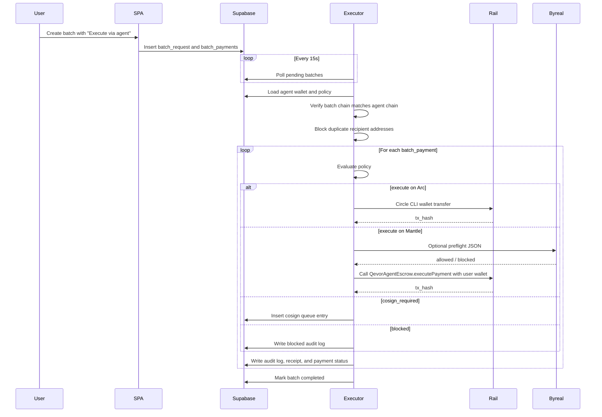
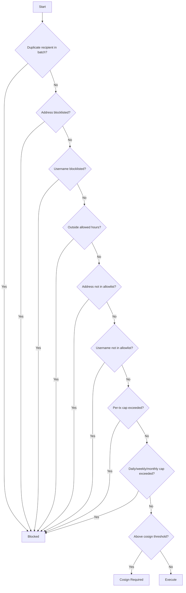

# Agent Stack Architecture

## Overview

The Agent Stack turns Qevor into policy-gated payment infrastructure that can be used by people and autonomous agents.

It now supports three execution rails:

1. **Arc Testnet via Circle CLI** - agent wallets, Circle session auth, and USDC transfers.
2. **Mantle Sepolia via contract escrow** - MNT transfers are executed through `QevorAgentEscrow` when `MANTLE_AGENT_ESCROW_CONTRACT_ADDRESS` is configured, with optional Byreal CLI preflight before signing.
3. **Mantle Mainnet via ERC-8004-linked escrow** - the same escrow pattern runs on Mantle mainnet, but the mainnet deploy path must link the escrow to Qevor's ERC-8004 agent identity.

Circle CLI does not currently expose Mantle as a wallet-transfer chain, so Mantle execution is handled by Qevor's native `viem` runner. Byreal is integrated as a configurable execution-layer preflight hook instead of a hardcoded command.

The official Byreal CLI is Solana-focused. Qevor installs it for Byreal skill compatibility, then uses `qevor-byreal-preflight.js` as the Mantle adapter. The wrapper receives Qevor payment JSON, performs Mantle-specific payment checks, reports whether `byreal-cli` is available, and returns structured `{ "allowed": true | false, "reason": "..." }` JSON to the Qevor API/executor.

Qevor calls Byreal in two places:

1. **Copilot planning preflight** - the API calls the Byreal adapter when a Mantle payment plan is created, then returns the execution-layer result to the UI.
2. **Executor signing preflight** - the Mantle executor calls the same Byreal adapter again immediately before signing or calling the escrow contract.

This makes Byreal visible in the product without letting it bypass Qevor policy or human approval.

The Mantle contract address requirement is satisfied by deploying `contracts/QevorAgentEscrow.sol` on Mantle Sepolia or Mantle mainnet. The executor calls `executePayment(paymentId, userWallet, recipient, amount)` on that contract, so the contract underpins the agentic payment logic instead of only existing for show. The escrow is shared infrastructure, but MNT is tracked per connected wallet through `balanceOf(userWallet)`.

Qevor does not deploy a substitute ERC-8004 registry. The registry owns the agent identity. Qevor's escrow is the agent wallet and economic execution account for that identity. After registering the Qevor agent in Mantle's ERC-8004 Identity Registry, the escrow owner calls `setAgentIdentity(identityRegistry, agentId, agentURI)`. Every `DecisionRecorded` event then includes the ERC-8004 agent ID, linking identity to economic activity, and the escrow also exposes `agentIdentity()` for registry/id/metadata discovery.

The escrow implements ERC-1271 `isValidSignature(bytes32,bytes)`, so verifiers can treat it as a contract-based agent wallet controlled by the escrow owner.

## Agent Skill API

Byreal, RealClaw, or another autonomous agent can use Qevor through the protected Agent Skill API:

- `GET /.well-known/qevor-agent-skills.json` discovers available skills.
- `POST /api/skills/payment-safety-review` checks invalid and duplicate recipients before execution.
- `POST /api/skills/batch-payment` creates an idempotent policy-gated agent batch.

Action requests require the `x-qevor-agent-key` header. The API key is stored only on the server as `QEVOR_AGENT_API_KEY`.

## Batch Executor Flow



## Policy Evaluation Order



## Production Environment

`qevor-executor` has no public port. It polls Supabase and executes approved work.

Required common settings:

```env
SUPABASE_URL=
SUPABASE_SERVICE_ROLE_KEY=
NODE_ENV=production
POLL_INTERVAL_MS=15000
HEARTBEAT_INTERVAL_MS=30000
```

Copilot API optional agent execution-layer settings:

```env
BYREAL_CLI_BIN=node
BYREAL_PREFLIGHT_ARGS=/opt/qevor/server/dist/executor/qevor-byreal-preflight.js
BYREAL_SOLANA_CLI_BIN=byreal-cli
QEVOR_BYREAL_MAX_PREFLIGHT_MNT=100
QEVOR_BYREAL_REQUIRE_CLI=0
OPENAI_API_KEY=
OPENAI_COPILOT_MODEL=
```

Arc rail:

```env
HOME=/var/lib/qevor-executor
CIRCLE_ACCEPT_TERMS=1
```

Mantle rail:

```env
MANTLE_SEPOLIA_RPC_URL=https://rpc.sepolia.mantle.xyz
MANTLE_AGENT_PRIVATE_KEY=
MANTLE_AGENT_ESCROW_CONTRACT_ADDRESS=
MANTLE_MAINNET_RPC_URL=https://rpc.mantle.xyz
MANTLE_MAINNET_AGENT_PRIVATE_KEY=
MANTLE_MAINNET_AGENT_ESCROW_CONTRACT_ADDRESS=
```

Compile the escrow:

```bash
forge build
```

Deploy on Mantle Sepolia:

```bash
forge create contracts/QevorAgentEscrow.sol:QevorAgentEscrow \
  --rpc-url "$MANTLE_SEPOLIA_RPC_URL" \
  --private-key "$MANTLE_AGENT_PRIVATE_KEY" \
  --constructor-args "$MANTLE_ESCROW_EXECUTOR_ADDRESS" "$MANTLE_ESCROW_MAX_PAYMENT_WEI" "$MANTLE_ESCROW_DAILY_LIMIT_WEI"
```

After Sepolia deployment:

1. Fund the contract with test MNT through `depositFor(userWallet)` or from the connected wallet.
2. Register the Qevor agent using `docs/erc8004-agent-registration.example.json`.
3. Call `setAgentIdentity(identityRegistry, agentId, agentURI)` on the escrow if an ERC-8004 test identity is available.
4. Set `MANTLE_AGENT_ESCROW_CONTRACT_ADDRESS` on the executor VPS.
5. Register the contract address as the Mantle agent wallet in Qevor.
6. Restart only the `qevor-executor` service.

For Mantle mainnet, use `deploy/deploy-mantle-mainnet.ps1`. It requires:

```env
MANTLE_MAINNET_ERC8004_IDENTITY_REGISTRY_ADDRESS=
MANTLE_MAINNET_ERC8004_AGENT_ID=
QEVOR_MAINNET_AGENT_URI=https://qevor.xyz/.well-known/erc8004/qevor-agent.json
```

The script deploys the escrow, then links the registry, agent ID, and metadata URI in the same operational run.

Optional Byreal preflight:

```env
BYREAL_CLI_BIN=node
BYREAL_PREFLIGHT_ARGS=/opt/qevor/server/dist/executor/qevor-byreal-preflight.js
BYREAL_SOLANA_CLI_BIN=byreal-cli
QEVOR_BYREAL_MAX_PREFLIGHT_MNT=100
QEVOR_BYREAL_REQUIRE_CLI=0
```

The preflight command receives transfer context as JSON on stdin and should return JSON on stdout:

```json
{ "allowed": true, "reason": "ok" }
```

Returning `{ "allowed": false, "reason": "..." }` blocks the transfer before signing.

Install the official Byreal CLI on the VPS:

```bash
npm install -g @byreal-io/byreal-cli
byreal-cli --version
```

## Key Tables

| Table | Purpose |
|-------|---------|
| `agent_wallets` | Registered agent wallets and chain assignment |
| `agent_policies` | Spending policies per wallet |
| `batch_requests` | Human-created or agent-created batch intents |
| `batch_payments` | Concrete payment rows for executor processing |
| `agent_audit_log` | Audit trail for every executor decision |
| `agent_cosign_queue` | Human approval queue for escalated transfers |
| `executor_health` | Executor heartbeat and rail status |
